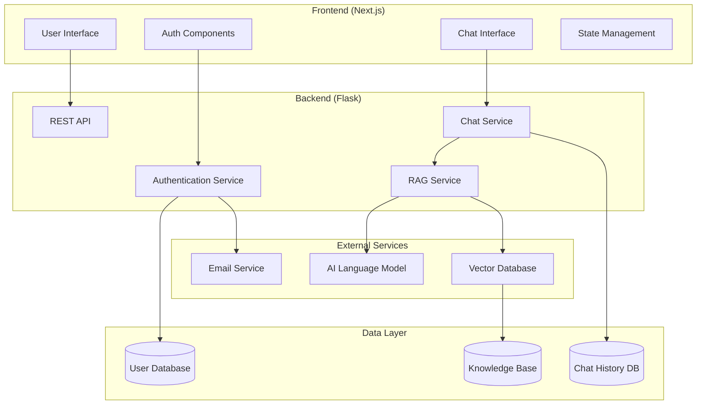

# Design Document

## Overview

The Interactive Tutor AI Chat system is designed as a modern web application with a clear separation between frontend and backend services. The architecture follows RESTful API principles with real-time capabilities for chat functionality. The system integrates multiple AI services including a base language model and a RAG (Retrieval-Augmented Generation) system for enhanced educational content delivery.

The application uses a microservices-inspired approach where the Flask backend serves as the API layer and business logic hub, while the Next.js frontend provides a responsive, interactive user interface. The system is designed for scalability, maintainability, and security.

## Architecture



### Technology Stack

**Frontend (Next.js)**
- Next.js 14+ with App Router
- TypeScript for type safety
- Tailwind CSS for styling
- React Query for API state management
- Socket.io-client for real-time chat
- React Hook Form for form handling
- Zustand for client-side state management

**Backend (Flask)**
- Flask with Flask-RESTful for API endpoints
- Flask-SQLAlchemy for database ORM
- Flask-JWT-Extended for authentication
- Flask-SocketIO for real-time communication
- Flask-CORS for cross-origin requests
- Flask-Mail for email services
- Celery for background tasks (RAG processing)

**AI and RAG Services**
- OpenAI API or similar LLM service
- ChromaDB or Pinecone for vector storage
- Sentence Transformers for embeddings
- LangChain for RAG orchestration

**Database**
- PostgreSQL for user data and chat history
- Redis for session storage and caching

## Components and Interfaces

### Frontend Components

#### Authentication Components
```typescript
// AuthProvider: Context provider for authentication state
interface AuthContextType {
  user: User | null;
  login: (email: string, password: string) => Promise<void>;
  logout: () => void;
  signup: (userData: SignupData) => Promise<void>;
  isLoading: boolean;
}

// LoginForm: User login interface
interface LoginFormProps {
  onSuccess: () => void;
  onError: (error: string) => void;
}

// SignupForm: User registration interface
interface SignupFormProps {
  onSuccess: () => void;
  onError: (error: string) => void;
}
```

#### Chat Components
```typescript
// ChatInterface: Main chat container
interface ChatInterfaceProps {
  conversationId?: string;
}

// MessageList: Display chat messages
interface MessageListProps {
  messages: Message[];
  isLoading: boolean;
}

// MessageInput: User input component
interface MessageInputProps {
  onSendMessage: (content: string) => void;
  disabled: boolean;
}

// ConversationSidebar: Chat history navigation
interface ConversationSidebarProps {
  conversations: Conversation[];
  activeConversationId: string;
  onSelectConversation: (id: string) => void;
}
```

### Backend API Endpoints

#### Authentication Endpoints
```python
# POST /api/auth/signup
# Request: { email, password, confirmPassword }
# Response: { message, user_id }

# POST /api/auth/login
# Request: { email, password }
# Response: { access_token, refresh_token, user }

# POST /api/auth/logout
# Headers: Authorization: Bearer <token>
# Response: { message }

# POST /api/auth/refresh
# Request: { refresh_token }
# Response: { access_token }
```

#### Chat Endpoints
```python
# GET /api/conversations
# Headers: Authorization: Bearer <token>
# Response: { conversations: [{ id, title, created_at, updated_at }] }

# POST /api/conversations
# Headers: Authorization: Bearer <token>
# Response: { conversation: { id, title, created_at } }

# GET /api/conversations/<id>/messages
# Headers: Authorization: Bearer <token>
# Response: { messages: [{ id, content, role, timestamp }] }

# POST /api/conversations/<id>/messages
# Headers: Authorization: Bearer <token>
# Request: { content, enable_rag }
# Response: { message: { id, content, role, timestamp } }
```

#### RAG Endpoints
```python
# POST /api/rag/query
# Headers: Authorization: Bearer <token>
# Request: { query, conversation_id, context_limit }
# Response: { response, sources, confidence_score }

# GET /api/rag/sources
# Headers: Authorization: Bearer <token>
# Response: { sources: [{ id, title, type, last_updated }] }
```

### Backend Services

#### Authentication Service
```python
class AuthService:
    def create_user(self, email: str, password: str) -> User
    def authenticate_user(self, email: str, password: str) -> Optional[User]
    def generate_tokens(self, user: User) -> dict
    def verify_token(self, token: str) -> Optional[User]
    def send_confirmation_email(self, user: User) -> bool
```

#### Chat Service
```python
class ChatService:
    def create_conversation(self, user_id: int) -> Conversation
    def get_user_conversations(self, user_id: int) -> List[Conversation]
    def add_message(self, conversation_id: int, content: str, role: str) -> Message
    def get_conversation_messages(self, conversation_id: int) -> List[Message]
    def generate_ai_response(self, conversation_id: int, user_message: str) -> str
```

#### RAG Service
```python
class RAGService:
    def __init__(self, vector_store, llm_client):
        self.vector_store = vector_store
        self.llm_client = llm_client
    
    def retrieve_relevant_content(self, query: str, limit: int = 5) -> List[Document]
    def generate_augmented_response(self, query: str, context: List[Document]) -> str
    def add_document_to_knowledge_base(self, document: Document) -> bool
    def update_embeddings(self, documents: List[Document]) -> bool
```

## Data Models

### User Model
```python
class User(db.Model):
    id = db.Column(db.Integer, primary_key=True)
    email = db.Column(db.String(120), unique=True, nullable=False)
    password_hash = db.Column(db.String(255), nullable=False)
    created_at = db.Column(db.DateTime, default=datetime.utcnow)
    is_confirmed = db.Column(db.Boolean, default=False)
    conversations = db.relationship('Conversation', backref='user', lazy=True)
```

### Conversation Model
```python
class Conversation(db.Model):
    id = db.Column(db.Integer, primary_key=True)
    user_id = db.Column(db.Integer, db.ForeignKey('user.id'), nullable=False)
    title = db.Column(db.String(200), nullable=True)
    created_at = db.Column(db.DateTime, default=datetime.utcnow)
    updated_at = db.Column(db.DateTime, default=datetime.utcnow, onupdate=datetime.utcnow)
    messages = db.relationship('Message', backref='conversation', lazy=True, cascade='all, delete-orphan')
```

### Message Model
```python
class Message(db.Model):
    id = db.Column(db.Integer, primary_key=True)
    conversation_id = db.Column(db.Integer, db.ForeignKey('conversation.id'), nullable=False)
    content = db.Column(db.Text, nullable=False)
    role = db.Column(db.String(20), nullable=False)  # 'user' or 'assistant'
    timestamp = db.Column(db.DateTime, default=datetime.utcnow)
    rag_sources = db.Column(db.JSON, nullable=True)  # Store RAG source references
```

### Knowledge Base Document Model
```python
class Document(db.Model):
    id = db.Column(db.Integer, primary_key=True)
    title = db.Column(db.String(200), nullable=False)
    content = db.Column(db.Text, nullable=False)
    document_type = db.Column(db.String(50), nullable=False)  # 'textbook', 'article', 'reference'
    embedding_id = db.Column(db.String(100), nullable=True)  # Reference to vector store
    created_at = db.Column(db.DateTime, default=datetime.utcnow)
    updated_at = db.Column(db.DateTime, default=datetime.utcnow, onupdate=datetime.utcnow)
```

## Error Handling

### Frontend Error Handling
- Global error boundary for React components
- API error interceptors with user-friendly messages
- Form validation with real-time feedback
- Network error detection and retry mechanisms
- Loading states and error states for all async operations

### Backend Error Handling
```python
# Custom exception classes
class AuthenticationError(Exception): pass
class ValidationError(Exception): pass
class RAGServiceError(Exception): pass
class DatabaseError(Exception): pass

# Global error handlers
@app.errorhandler(AuthenticationError)
def handle_auth_error(error):
    return jsonify({'error': 'Authentication failed'}), 401

@app.errorhandler(ValidationError)
def handle_validation_error(error):
    return jsonify({'error': str(error)}), 400

@app.errorhandler(RAGServiceError)
def handle_rag_error(error):
    return jsonify({'error': 'AI service temporarily unavailable'}), 503
```

### Error Logging and Monitoring
- Structured logging with correlation IDs
- Error tracking with Sentry or similar service
- Performance monitoring for API endpoints
- RAG service health checks and fallback mechanisms

## Testing Strategy

### Frontend Testing
- **Unit Tests**: Jest and React Testing Library for components
- **Integration Tests**: API integration with MSW (Mock Service Worker)
- **E2E Tests**: Playwright for critical user flows
- **Accessibility Tests**: axe-core for WCAG compliance

### Backend Testing
- **Unit Tests**: pytest for individual functions and classes
- **Integration Tests**: Test database operations and API endpoints
- **RAG System Tests**: Mock AI services for consistent testing
- **Load Tests**: Test concurrent user scenarios

### Test Coverage Goals
- Minimum 80% code coverage for both frontend and backend
- 100% coverage for authentication and security-related code
- Comprehensive testing of RAG retrieval accuracy
- Performance benchmarks for response times

### Testing Environment
- Separate test databases for isolation
- Mock AI services to avoid external dependencies
- Automated testing in CI/CD pipeline
- Staging environment for integration testing

This design provides a solid foundation for building a scalable, maintainable interactive tutor AI chat system that meets all the specified requirements while following modern web development best practices.